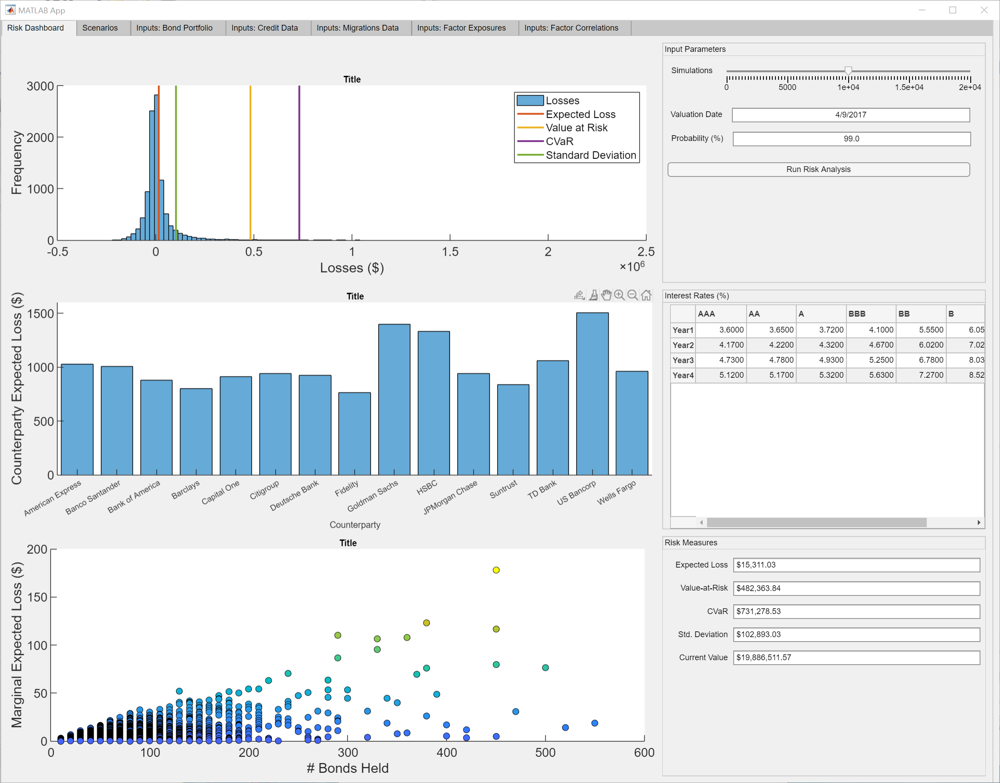
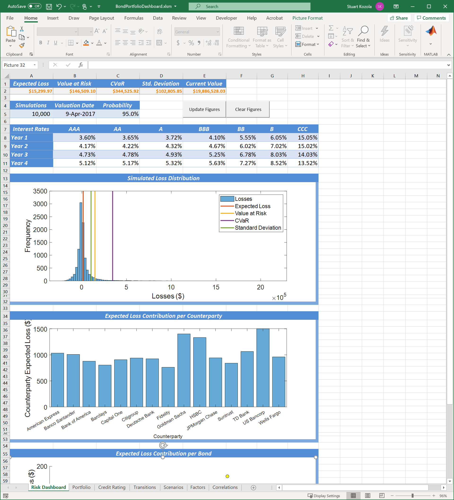

# prmia-2021-matlab-challenge
 Example demo files for building risk dashboards

## Risk App in MATLAB
1. Open BondPortfolioDashboard.mlapp to run the app


## Spreadsheet Example (Using Spreadsheet Link)
1. Open `BondPortfolioDashboard.xlsm`
2. Activate or install the Spreadsheet Link Add-in
3. To see the cells that call MATLAB, look for orange colored text


## Files of note
```
*.xlsm Spreadsheet dashboard
*.csv files contain data used by the app
*.m files are functions
*.fig files contain examples figures generated from `riskCalc.m`
*.mat files contain pre-trained machine learning models used for the credit scoring
```